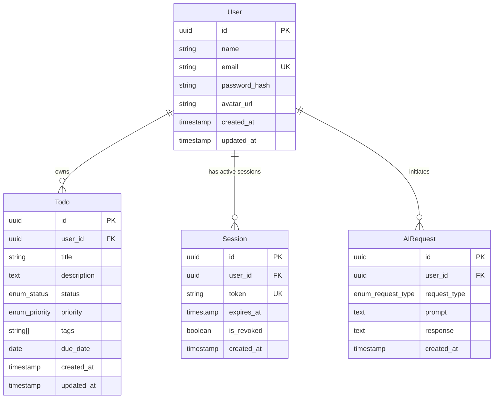

# Data Model: Phase 2 Premium Web SaaS Layer

**Feature**: 001-phase-2-saas
**Date**: 2025-01-23
**Purpose**: Define database schema, entities, relationships, and constraints

---

## Entity Relationship Diagram



---

## Tables

### 1. users

Stores user account information and authentication credentials.

| Column | Type | Constraints | Description |
|--------|------|-------------|-------------|
| `id` | UUID | PK, NOT NULL | Unique user identifier |
| `name` | VARCHAR(255) | NOT NULL | User's display name |
| `email` | VARCHAR(255) | UNIQUE, NOT NULL, LOWERCASE | User's email address (login credential) |
| `password_hash` | VARCHAR(255) | NOT NULL | Bcrypt hashed password |
| `avatar_url` | VARCHAR(500) | NULL | URL to user's avatar image (Cloudinary) |
| `created_at` | TIMESTAMP | DEFAULT NOW() | Account creation timestamp |
| `updated_at` | TIMESTAMP | DEFAULT NOW(), ON UPDATE NOW() | Last update timestamp |

**Indexes**:
- `idx_users_email` on `email` (for login lookups)
- `idx_users_created_at` on `created_at` (for analytics)

**Validation Rules**:
- `email`: Must be valid email format, case-insensitive unique
- `password_hash`: Bcrypt hash with 12 rounds (cost factor)
- `name`: 1-255 characters, no leading/trailing whitespace
- `avatar_url`: If present, must be valid HTTPS URL

**Default Avatar**:
- If `avatar_url` is NULL, generate using: `https://ui-avatars.com/api/?name={name}&background=random`

---

### 2. todos

Stores user's todo items with metadata for filtering and sorting.

| Column | Type | Constraints | Description |
|--------|------|-------------|-------------|
| `id` | UUID | PK, NOT NULL | Unique todo identifier |
| `user_id` | UUID | FK→users.id, NOT NULL | Owner of this todo |
| `title` | VARCHAR(500) | NOT NULL | Todo title (required) |
| `description` | TEXT | NULL | Detailed description (optional) |
| `status` | VARCHAR(20) | NOT NULL, DEFAULT 'pending' | 'pending' or 'completed' |
| `priority` | VARCHAR(20) | NOT NULL, DEFAULT 'medium' | 'low', 'medium', or 'high' |
| `tags` | TEXT[] | NULL | Array of tag strings |
| `due_date` | DATE | NULL | Optional due date |
| `created_at` | TIMESTAMP | DEFAULT NOW() | Creation timestamp |
| `updated_at` | TIMESTAMP | DEFAULT NOW(), ON UPDATE NOW() | Last update timestamp |

**Indexes**:
- `idx_todos_user_id` on `user_id` (for user filtering)
- `idx_todos_status` on `status` (for status filtering)
- `idx_todos_priority` on `priority` (for priority filtering)
- `idx_todos_due_date` on `due_date` (for sorting by due date)
- `idx_todos_created_at` on `created_at` (for sorting by creation)
- `idx_todos_user_status` on `(user_id, status)` (composite for dashboard queries)

**Validation Rules**:
- `title`: 1-500 characters, cannot be empty
- `status`: Must be one of ['pending', 'completed']
- `priority`: Must be one of ['low', 'medium', 'high']
- `tags`: Array of strings, each 1-50 characters
- `due_date`: Must be >= created_at (cannot create todos with past due dates)

**Data Isolation**:
- All queries MUST include `WHERE user_id = ?` clause
- Backend enforces user_id from JWT token, never from client input

---

### 3. sessions

Stores active user sessions for JWT token management.

| Column | Type | Constraints | Description |
|--------|------|-------------|-------------|
| `id` | UUID | PK, NOT NULL | Unique session identifier |
| `user_id` | UUID | FK→users.id, NOT NULL | User who owns this session |
| `token` | VARCHAR(500) | UNIQUE, NOT NULL | JWT token (hashed) |
| `expires_at` | TIMESTAMP | NOT NULL | Token expiration timestamp |
| `is_revoked` | BOOLEAN | DEFAULT FALSE | True if token was revoked (logout) |
| `created_at` | TIMESTAMP | DEFAULT NOW() | Session creation timestamp |

**Indexes**:
- `idx_sessions_token` on `token` (for token validation)
- `idx_sessions_user_id` on `user_id` (for user session lookup)
- `idx_sessions_expires_at` on `expires_at` (for cleanup of expired sessions)

**Validation Rules**:
- `expires_at`: Must be > created_at (typically 7 days)
- `token`: Hashed version of JWT (SHA-256) for storage

**Cleanup Job**:
- Run daily: `DELETE FROM sessions WHERE expires_at < NOW()`

**Security Note**:
- Token is hashed before storage (JWT contains user_id, exp, etc.)
- On logout: Set `is_revoked = TRUE` (token blacklist for Phase 3)

---

### 4. ai_requests

Stores AI assistant interactions for logging and rate limiting.

| Column | Type | Constraints | Description |
|--------|------|-------------|-------------|
| `id` | UUID | PK, NOT NULL | Unique request identifier |
| `user_id` | UUID | FK→users.id, NOT NULL | User who initiated request |
| `request_type` | VARCHAR(50) | NOT NULL | 'generate', 'summarize', or 'prioritize' |
| `prompt` | TEXT | NOT NULL | User's prompt to AI |
| `response` | TEXT | NULL | AI's response |
| `created_at` | TIMESTAMP | DEFAULT NOW() | Request timestamp |

**Indexes**:
- `idx_ai_requests_user_id` on `user_id` (for user's request history)
- `idx_ai_requests_created_at` on `created_at` (for time-based rate limiting)
- `idx_ai_requests_user_created` on `(user_id, created_at)` (composite for rate limit queries)

**Validation Rules**:
- `request_type`: Must be one of ['generate', 'summarize', 'prioritize']
- `prompt`: 1-5000 characters

**Rate Limiting Query**:
```sql
-- Count requests in last hour
SELECT COUNT(*)
FROM ai_requests
WHERE user_id = ? AND created_at > NOW() - INTERVAL '1 hour'
```

---

## Relationships

### User → Todo (One-to-Many)

```
User.id → Todo.user_id
```

- **Cascade**: If user deleted, delete all user's todos (ON DELETE CASCADE)
- **Constraint**: Todo must have user_id (NOT NULL, FK)
- **Access**: User can only access their own todos

### User → Session (One-to-Many)

```
User.id → Session.user_id
```

- **Cascade**: If user deleted, revoke all sessions (ON DELETE CASCADE)
- **Purpose**: Track active sessions, enable logout (token revocation in Phase 3)

### User → AIRequest (One-to-Many)

```
User.id → AIRequest.user_id
```

- **Cascade**: If user deleted, delete AI request history (ON DELETE CASCADE)
- **Purpose**: Rate limiting, analytics, debugging

---

## State Transitions

### Todo Status

```
pending → completed → pending
   ↑___________|
```

- User can toggle status (pending ↔ completed)
- No other states (no "in_progress", "cancelled", etc. in Phase 2)

### Session Status

```
active → expired
active → revoked
```

- **active**: `is_revoked = FALSE` AND `expires_at > NOW()`
- **expired**: `expires_at <= NOW()` (automatically invalid)
- **revoked**: `is_revoked = TRUE` (user logged out)

---

## SQLModel Definitions

### User Model

```python
from typing import Optional
from sqlmodel import SQLModel, Field, Relationship
from datetime import datetime
from uuid import UUID, uuid4

class User(SQLModel, table=True):
    __tablename__ = "users"

    id: UUID = Field(default_factory=uuid4, primary_key=True)
    name: str = Field(max_length=255, index=True)
    email: str = Field(unique=True, index=True, max_length=255)
    password_hash: str = Field(max_length=255)
    avatar_url: Optional[str] = Field(default=None, max_length=500)
    created_at: datetime = Field(default_factory=datetime.utcnow)
    updated_at: datetime = Field(default_factory=datetime.utcnow, sa_column_kwargs={"onupdate": datetime.utcnow})

    # Relationships
    todos: list["Todo"] = Relationship(back_populates="user")
    sessions: list["Session"] = Relationship(back_populates="user")
    ai_requests: list["AIRequest"] = Relationship(back_populates="user")
```

### Todo Model

```python
from typing import Optional, List
from enum import Enum

class TodoStatus(str, Enum):
    PENDING = "pending"
    COMPLETED = "completed"

class TodoPriority(str, Enum):
    LOW = "low"
    MEDIUM = "medium"
    HIGH = "high"

class Todo(SQLModel, table=True):
    __tablename__ = "todos"

    id: UUID = Field(default_factory=uuid4, primary_key=True)
    user_id: UUID = Field(foreign_key="users.id", index=True, nullable=False)
    title: str = Field(max_length=500, nullable=False)
    description: Optional[str] = Field(default=None)
    status: TodoStatus = Field(default=TodoStatus.PENDING, index=True)
    priority: TodoPriority = Field(default=TodoPriority.MEDIUM, index=True)
    tags: Optional[List[str]] = Field(default=None, sa_column_kwargs={"type_": "TEXT"})
    due_date: Optional[datetime] = Field(default=None, index=True)
    created_at: datetime = Field(default_factory=datetime.utcnow, index=True)
    updated_at: datetime = Field(default_factory=datetime.utcnow, sa_column_kwargs={"onupdate": datetime.utcnow})

    # Relationships
    user: User = Relationship(back_populates="todos")
```

### Session Model

```python
class Session(SQLModel, table=True):
    __tablename__ = "sessions"

    id: UUID = Field(default_factory=uuid4, primary_key=True)
    user_id: UUID = Field(foreign_key="users.id", index=True, nullable=False)
    token: str = Field(unique=True, index=True, max_length=500)
    expires_at: datetime = Field(index=True)
    is_revoked: bool = Field(default=False)
    created_at: datetime = Field(default_factory=datetime.utcnow)

    # Relationships
    user: User = Relationship(back_populates="sessions")
```

### AIRequest Model

```python
class AIRequestType(str, Enum):
    GENERATE = "generate"
    SUMMARIZE = "summarize"
    PRIORITIZE = "prioritize"

class AIRequest(SQLModel, table=True):
    __tablename__ = "ai_requests"

    id: UUID = Field(default_factory=uuid4, primary_key=True)
    user_id: UUID = Field(foreign_key="users.id", index=True, nullable=False)
    request_type: AIRequestType = Field(nullable=False)
    prompt: str = Field(nullable=False, sa_column_kwargs={"type_": "TEXT"})
    response: Optional[str] = Field(default=None, sa_column_kwargs={"type_": "TEXT"})
    created_at: datetime = Field(default_factory=datetime.utcnow, index=True)

    # Relationships
    user: User = Relationship(back_populates="ai_requests")
```

---

## Database Migration (Alembic)

### Initial Migration

```python
# alembic/versions/001_initial_schema.py

from alembic import op
import sqlalchemy as sa
from sqlalchemy.dialects import postgresql

revision = '001'
down_revision = None
branch_labels = None
depends_on = None

def upgrade():
    op.create_table(
        'users',
        sa.Column('id', postgresql.UUID(as_uuid=True), primary_key=True),
        sa.Column('name', sa.String(255), nullable=False),
        sa.Column('email', sa.String(255), nullable=False, unique=True),
        sa.Column('password_hash', sa.String(255), nullable=False),
        sa.Column('avatar_url', sa.String(500), nullable=True),
        sa.Column('created_at', sa.TIMESTAMP(), server_default=sa.text('NOW()'), nullable=False),
        sa.Column('updated_at', sa.TIMESTAMP(), server_default=sa.text('NOW()'), nullable=False),
    )
    op.create_index('idx_users_email', 'users', ['email'])
    op.create_index('idx_users_created_at', 'users', ['created_at'])

    op.create_table(
        'todos',
        sa.Column('id', postgresql.UUID(as_uuid=True), primary_key=True),
        sa.Column('user_id', postgresql.UUID(as_uuid=True), sa.ForeignKey('users.id', ondelete='CASCADE'), nullable=False),
        sa.Column('title', sa.String(500), nullable=False),
        sa.Column('description', sa.Text(), nullable=True),
        sa.Column('status', sa.String(20), nullable=False, server_default='pending'),
        sa.Column('priority', sa.String(20), nullable=False, server_default='medium'),
        sa.Column('tags', postgresql.TEXT(), nullable=True),
        sa.Column('due_date', sa.Date(), nullable=True),
        sa.Column('created_at', sa.TIMESTAMP(), server_default=sa.text('NOW()'), nullable=False),
        sa.Column('updated_at', sa.TIMESTAMP(), server_default=sa.text('NOW()'), nullable=False),
    )
    op.create_index('idx_todos_user_id', 'todos', ['user_id'])
    op.create_index('idx_todos_status', 'todos', ['status'])
    op.create_index('idx_todos_priority', 'todos', ['priority'])
    op.create_index('idx_todos_due_date', 'todos', ['due_date'])
    op.create_index('idx_todos_created_at', 'todos', ['created_at'])
    op.create_index('idx_todos_user_status', 'todos', ['user_id', 'status'])

    op.create_table(
        'sessions',
        sa.Column('id', postgresql.UUID(as_uuid=True), primary_key=True),
        sa.Column('user_id', postgresql.UUID(as_uuid=True), sa.ForeignKey('users.id', ondelete='CASCADE'), nullable=False),
        sa.Column('token', sa.String(500), nullable=False, unique=True),
        sa.Column('expires_at', sa.TIMESTAMP(), nullable=False),
        sa.Column('is_revoked', sa.Boolean(), server_default='FALSE', nullable=False),
        sa.Column('created_at', sa.TIMESTAMP(), server_default=sa.text('NOW()'), nullable=False),
    )
    op.create_index('idx_sessions_token', 'sessions', ['token'])
    op.create_index('idx_sessions_user_id', 'sessions', ['user_id'])
    op.create_index('idx_sessions_expires_at', 'sessions', ['expires_at'])

    op.create_table(
        'ai_requests',
        sa.Column('id', postgresql.UUID(as_uuid=True), primary_key=True),
        sa.Column('user_id', postgresql.UUID(as_uuid=True), sa.ForeignKey('users.id', ondelete='CASCADE'), nullable=False),
        sa.Column('request_type', sa.String(50), nullable=False),
        sa.Column('prompt', sa.Text(), nullable=False),
        sa.Column('response', sa.Text(), nullable=True),
        sa.Column('created_at', sa.TIMESTAMP(), server_default=sa.text('NOW()'), nullable=False),
    )
    op.create_index('idx_ai_requests_user_id', 'ai_requests', ['user_id'])
    op.create_index('idx_ai_requests_created_at', 'ai_requests', ['created_at'])
    op.create_index('idx_ai_requests_user_created', 'ai_requests', ['user_id', 'created_at'])

def downgrade():
    op.drop_table('ai_requests')
    op.drop_table('sessions')
    op.drop_table('todos')
    op.drop_table('users')
```

---

## Data Constraints Summary

| Constraint | Type | Table | Description |
|------------|------|-------|-------------|
| `users_email_key` | UNIQUE | users | Email must be unique (case-insensitive) |
| `users_id_pkey` | PK | users | Primary key |
| `todos_user_id_fkey` | FK | todos | References users.id, CASCADE on delete |
| `sessions_user_id_fkey` | FK | sessions | References users.id, CASCADE on delete |
| `sessions_token_key` | UNIQUE | sessions | Token must be unique |
| `ai_requests_user_id_fkey` | FK | ai_requests | References users.id, CASCADE on delete |

---

## Performance Considerations

### Index Usage

- **User login**: `idx_users_email`
- **Dashboard load**: `idx_todos_user_status` (composite)
- **Todo filtering**: `idx_todos_status`, `idx_todos_priority`
- **Todo sorting**: `idx_todos_due_date`, `idx_todos_created_at`
- **Token validation**: `idx_sessions_token`
- **Rate limiting**: `idx_ai_requests_user_created` (composite)

### Query Patterns

**Dashboard (most common)**:
```sql
SELECT * FROM todos
WHERE user_id = ? AND status = 'pending'
ORDER BY created_at DESC
LIMIT 20;
```
Uses: `idx_todos_user_status`

**Login**:
```sql
SELECT * FROM users
WHERE LOWER(email) = LOWER(?);
```
Uses: `idx_users_email`

**Rate Limit Check**:
```sql
SELECT COUNT(*) FROM ai_requests
WHERE user_id = ? AND created_at > NOW() - INTERVAL '1 hour';
```
Uses: `idx_ai_requests_user_created`

---

## Next Steps

1. ✅ **Data Model Complete**: All tables, relationships, indexes defined
2. **Phase 1 Next**: Generate `contracts/openapi.json` for API specification
3. **Phase 1 Next**: Generate `quickstart.md` for developer setup
4. **Phase 2 Next**: Run `/sp.tasks` to create implementation tasks

---

**Data Model Status**: ✅ Complete
**Last Updated**: 2025-01-23
